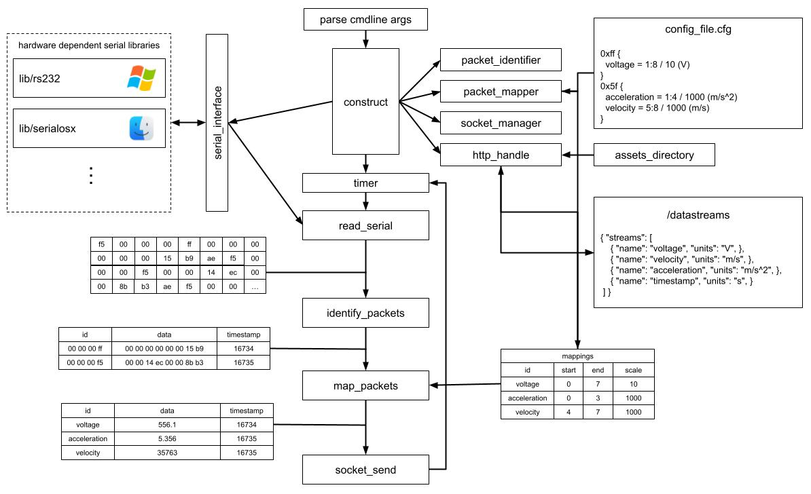

# TelemetryCore

Part of Texas A&M Formula SAE Telemetry Network.

TelemetryCore is a fast telemetry proxy used to bridge information from the car's network to the base station.

<!---->
<!--  -->

<!--Questions: contact Justus <jus@justusl.com>-->

## Quickstart 

Assuming you have `telemtrycore.exe` installed at some path in your system, here is you can get started using the service.

The first step is to ensure that we have the important resources:

1. We need the binary somewhere in the filesystem, for ex. `/path/to/telemetrycore.exe`.
2. We need a valid config file somewhere, for ex. `/path/to/configfile.cfg`.
3. We need an asset directory with the distributable HTML, JavaScript, and CSS for the telemetry client, for ex. `path/to/assetsdir`.

**Note:** you might want to become familiar with the various command line arguments. For usage, run `/path/to/telemtrycore.exe -h`.

Lets review the important arguments that are required to run the service:

* `-s` specify the serial port, this is required.
* `-c` specify the config file path, this is also required.
* `-a` specify the assets directory path, default is `assets` (means `${PWD}/assets`, if you don't understand this google it), but this should probably be required.

There are other important arguments, so run `/path/to/telemtrycore.exe -h` to view them.

